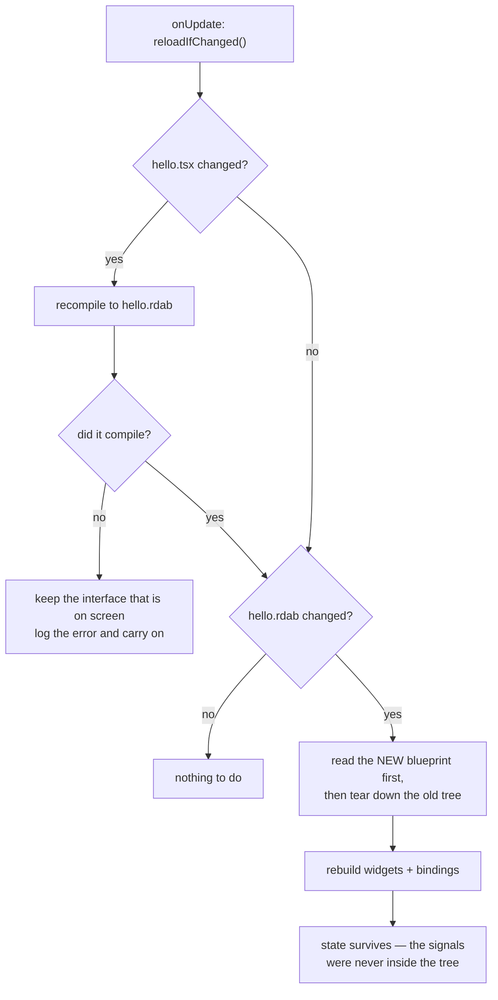

# Hot reload

Debug builds only. `RDA_ENABLE_HOT_RELOAD` is what pulls the layout compiler into the
binary at all — a Release build contains neither it nor QuickJS.

Two properties fall out of the design rather than being engineered:

- **A syntax error costs you a message, not your window.** The interface on screen is the
  last one that compiled.
- **State survives a reload.** Signals live in the application, outside the artifact being
  replaced, so the rebuild is total and still correct. Click a button, edit a label, save
  — the label changes and the count does not.

A development build is told where the *source* lives (`MYAPP_SOURCE_DIR`), because
assets are copied beside the executable and editing the copy would change nothing anyone
can see.

---

Back to [the architecture index](README.md) · [all documentation](../README.md)
