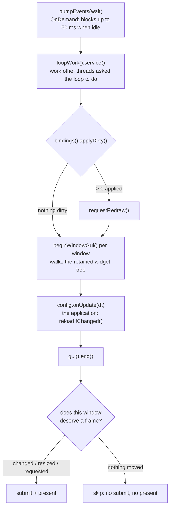
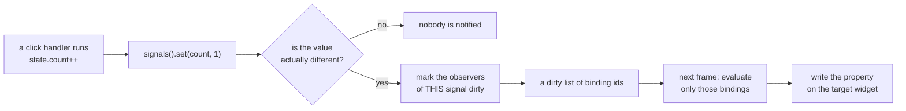

# One frame, and why there is no diffing

## One frame

`applyDirty()` runs **before** the tree is walked, so the walk sees this frame's values
rather than last frame's. On almost every frame the dirty list is empty and the whole step
costs one check.

When it does apply something it also **marks the retained cache dirty**, and that is not
optional. The cache decides whether to walk the tree by looking at input — the pointer
moving, a button, a key, a focused caret. A binding writing a widget property is none of
those, so without it the frame renders the geometry it already had and the change does not
appear until something unrelated moves the mouse. It looked like the interface lagging by
a second or two; it was the interface being right and the screen showing the frame before.

The redraw decision is per window, not per loop. An idle window costs an idle window —
that mattered most back when windows belonged to different processes, where one animating
application dragged every other one through a redraw it had no reason to want.

---

## Why there is no diffing

This is the part worth understanding, because it is what makes the whole thing cheap.

There is no virtual tree, no reconciliation and no search. A signal knows its observers, a
binding knows its target widget and property, and a write that changes nothing notifies
nobody. React's model without React's machinery — the dependency graph is built once, at
load, from what the compiler already recorded.

A binding whose program fails is switched **off** rather than retried every frame: it will
be just as wrong next frame, and a warning per frame is a warning nobody reads.

---

Back to [the architecture index](README.md) · [all documentation](../README.md)
