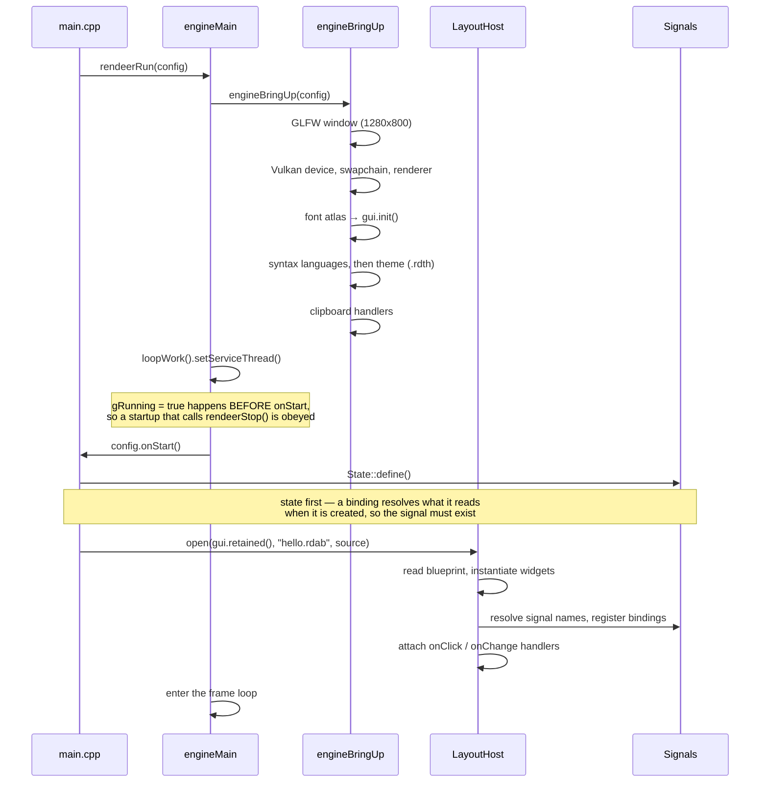

# Starting up

Two ordering rules in there are load-bearing and were both bugs once:

- `gRunning = true` is set **before** `onStart`, so a startup that decides to stop is not
  overwritten by the loop raising the flag afterwards.
- `State::define()` runs **before** the layout opens, because a binding resolves the
  signals it reads at creation time.

---

Back to [the architecture index](README.md) · [all documentation](../README.md)
