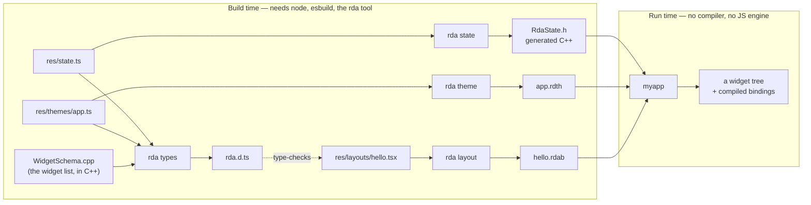

# The two halves, and what the compiler does

## The two halves

Everything divides into what happens when you build and what happens when you run. They
meet at one file format.

`rda.d.ts` is generated *from the C++ widget schema*, which is why a property that exists
at runtime exists in the editor and vice versa. Adding `hAlign` to a stack meant declaring
it once in `WidgetSchema.cpp`; the TypeScript union appeared without anyone writing it.

---

## What the layout compiler actually does

Three steps, in `src/Layout/LayoutCompiler.cpp`:

1. **Transform** — esbuild rewrites the `.tsx` into plain JS where every element is a call
   to `h(type, props, ...children)`. Types are erased here; they were never for the
   runtime.
2. **Evaluate** — QuickJS runs that JS once and calls the module's default export. The
   result is a tree of plain objects. This is the only time JavaScript ever executes.
3. **Flatten** — the tree becomes a blueprint: nodes breadth-first with contiguous
   children, properties as POD, one string table, and every `{() => ...}` expression
   compiled to stack bytecode.

The blueprint header carries counts for each section — nodes, props, bindings,
instructions, refs, numbers, strings — so loading is a set of bounds-checked spans over
one buffer, not a parse.

An expression that the restricted grammar refuses (a function call, a variable closed over
from the surrounding code) is a **hard error at build time**, not a silent nothing at
runtime. That is deliberate: the failure has to land where the person who wrote it is
looking.

---

Back to [the architecture index](README.md) · [all documentation](../README.md)
